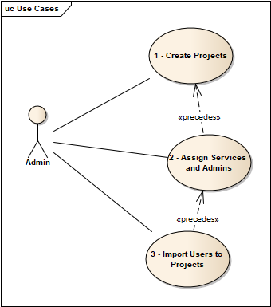

# forge-bim360.project.setup.tool


[](http://opensource.org/licenses/MIT)

[](http://developer.autodesk.com/)
[](http://developer.autodesk.com/)


[](http://opensource.org/licenses/MIT)


# Description
Command line tool to setup BIM 360 projects, services, users, it includes the following functionalities:
- Create Projects in Batch
- Copy Projects with Folders from a template project
- Activate Services by Adding User as Admin
- Add Users to Project as Admin or User

# Thumbnail


# Prerequisites
- Visual Studio: Either Community (Windows) or Code (Windows, MacOS).
- CefSharp: Chromium based browser control for .NET apps
- .NET Framework basic knowledge with C#

# Running locally
- For using this sample, you need an Autodesk developer credentials. Visit the [Forge Developer Portal](https://developer.autodesk.com), sign up for an account, then [create an app](https://developer.autodesk.com/myapps/create). 
- Connect your Forge App to a Specific BIM 360 Account, follow the [tutorial](https://forge.autodesk.com/en/docs/bim360/v1/tutorials/getting-started/get-access-to-account/)
- Download the repository, open `BimProjectSetupTool.sln` Solution on Visual Studio. The build process should download the required packages (**Autodesk.Forge** and dependencies). Compile and build the project, run it, please check the [User Guide](BIM360-ProjectSetupTool-UsageGuide.pdf) for all the details about usage and preparation of csv files.

# Features


This sample app includes a few features as detailed in [User Guide](BIM360-ProjectSetupTool-UsageGuide.pdf), in short, please follow the scripts to create projects, activate services, then add project users.

Always replace the capitalized content in braces with your values before executing the script:
 ```powershell
 "<YOUR-CLIENT-ID>" - e.g. "LI8CLkyS4zO4OIvRPW2nPzR2UHk0zU7"
 etc.
 ```

## Create BIM360 projects:
 ```powershell
Autodesk.BimProjectSetup.exe -p ".\sample\BIM360_Projects_Template.csv" -c "<YOUR-CLIENT-ID>" -s "<YOUR-CLIENT-SECRET>" -a "<ACCOUNT-ID>" -b "https://developer.api.autodesk.com" -t ";" -z "," -e "UTF-8" -d "yyyy-MM-dd" -r false -h "admin.account@yourcompany.com"
```
If you want to create project with folders, please add --CF as follow:
 ```powershell
Autodesk.BimProjectSetup.exe -p ".\sample\BIM360_Projects_Template.csv" -c "<YOUR-CLIENT-ID>" -s "<YOUR-CLIENT-SECRET>" -a "<ACCOUNT-ID>" -b "https://developer.api.autodesk.com" -t ";" -z "," -e "UTF-8" -d "yyyy-MM-dd" -r false -h "admin.account@yourcompany.com" --CF
```
## Activate Services by Adding User as Admin
 ```powershell
Autodesk.BimProjectSetup.exe -s ".\sample\BIM360_Service_Template.csv" -c "<YOUR-CLIENT-ID>" -s "<YOUR-CLIENT-SECRET>" -a "<ACCOUNT-ID>" -b "https://developer.api.autodesk.com" -t ";" -z "," -e "UTF-8" -d "yyyy-MM-dd" -r false -h "admin.account@yourcompany.com"
```
## Add Users to Project as Admin or User
 ```powershell
Autodesk.BimProjectSetup.exe -u ".\sample\BIM360_ProjectUser_Template.csv" -c "<YOUR-CLIENT-ID>" -s "<YOUR-CLIENT-SECRET>" -a "<ACCOUNT-ID>" -b "https://developer.api.autodesk.com" -t ";" -z "," -e "UTF-8" -d "yyyy-MM-dd" -r false -h "admin.account@yourcompany.com"
```
Note: These template files used in the scripts are just samples which are defined in the spreadsheet structure for you to reference, all required fields must be filled in order for the tool to work properly, please refer the [User Guide](BIM360-ProjectSetupTool-UsageGuide.pdf) for the details.


## Command Line Options
- Usage: Autodesk.BimProjectSetup.exe [-p] [-x] [-u] [-c] [-s] [-a] [-b] [-t] [-z] [-e] [-d] [-r] [-h] [--CF][--AR][–EU]
    - -p Path to CSV input file for project creation
    - -x Path to CSV input file for service activation
    - -u Path to CSV input file with project user information
    - -c Forge client ID
    - -s Forge client secret
    - -a BIM 360 Account ID
    - -b BaseUrl (default= "https://developer.api.autodesk.com")
    - -t Separator character (default = ';')
    - -z Second Separator character (default = ',')
    - -e Encoding (default = UTF-8)
    - -d Date time format pattern(default = yyyy-MM-dd)
    - -r Trial run [true/false] (default = false)
    - -h BIM 360 Account admin Email address
    - --CF Copy folders
    - --AR Admin Industry Role
    - --EU Use the EU region account

# Packages 3rd party libraries used
- The app use [NuGet](https://api.nuget.org/v3/index.json) to manage all the packages
- The [Autodesk.Forge](https://www.nuget.org/packages/Autodesk.Forge/) packages is included by default
- [Newtonsoft.Json](https://www.newtonsoft.com/json)
- [NLog](https://nlog-project.org/)
- [RestSharp](http://restsharp.org/)


# Further Reading
**Documentation:**
- [BIM 360 API](https://developer.autodesk.com/en/docs/bim360/v1/overview/) and [App Provisioning](https://forge.autodesk.com/blog/bim-360-docs-provisioning-forge-apps)


# Tips & Tricks
- At least one path to an input file must be provided with the -p, -x or -u options;
- Special care must be taken when editing the file in Microsoft Excel:
    1. Make sure that Excel does not alter the date formatting to the System format on the machine which the file is edited. By default the dd/MM/YYYY is used in the CSV to format the date. When the Windows system uses a different time/date format, this sometimes causes Excel to save the date to the default Windows system format. This format can be changed in Configuration Panel | Regional Settings
    2. Make sure the .CSV file is formatted in UTF-8 code.
    3. Open the file in a text editor such as Notepad++ after it was saved to ensure the above two points.
- Logging can be configured in the Nlog.config file. Further information can be found here: https://github.com/nlog/NLog/wiki/Configuration-file.


# Limitation
- CSV files need to be prepared with the correct format and required parameters, check [User Guide](BIM360-ProjectSetupTool-UsageGuide.pdf) for details.
- From the services listed in  [service_type parameters documentation](https://forge.autodesk.com/en/docs/bim360/v1/overview/parameters/) only the following can be activated by this tool: **doc_manager**, **field**, **glue**. The parameter values field and glue are used for the **'classic'** products, not for the next gen products
- Copy folder can't copy permissions with this tool.
- **Copy Folder** only support **Plan** and **Project File** folder and their subfolders.

# License

This sample is licensed under the terms of the [MIT License](http://opensource.org/licenses/MIT). Please see the [LICENSE](LICENSE.md) file for full details.


# Written by
- Oliver Scharpf, Global Consulting Delivery team, Autodessk.
- Reviewed and maintained by Zhong Wu [@johnonsoftware](https://twitter.com/johnonsoftware), [Forge Partner Development](http://forge.autodesk.com)
